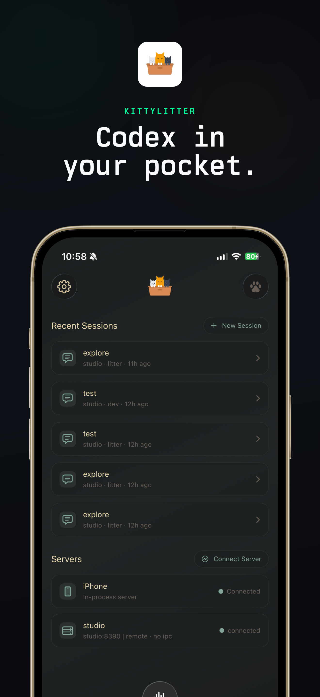
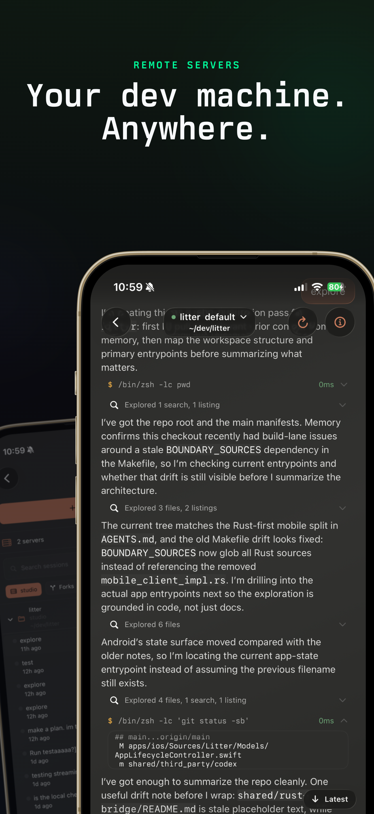
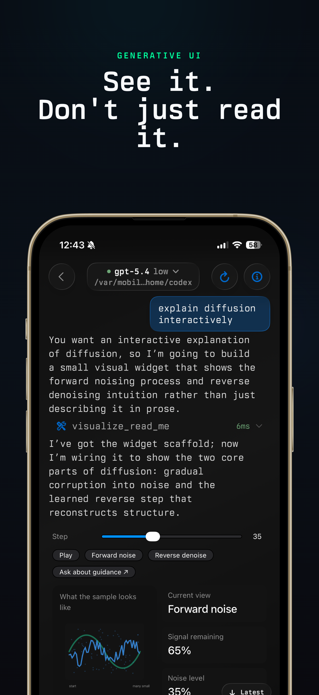
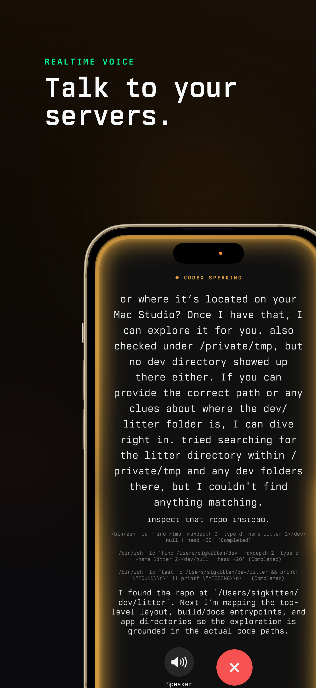

# 包子

<p align="center">
  
</p>

<p align="center">
  Native iOS + Android client that remote-controls AI coding agents (<a href="https://github.com/openai/codex">Codex</a>, Claude, and more) running on your own Mac. Pair your phone with a lightweight daemon on your computer to manage sessions, stream output, and run agentic coding workflows on the go.
</p>

<p align="center">
  <a href="https://github.com/huangguang1999/baozi"></a>
  &nbsp;
  &nbsp;
  <a href="https://github.com/huangguang1999/baozi/android-beta"></a>
</p>

## Screenshots (iOS)

<p align="center">
  
  
  
  
</p>

## Quick Start

```bash
make ios-device-fast   # fast device build
make ios-sim-fast      # fast simulator build
make android-emulator-fast  # fast Android emulator build
```

### Fresh Checkout Prerequisites

After pairing a **new Apple Watch** with Xcode (Window → Devices and Simulators),
run this once so CLI builds can install BaoziWatch on it:

```bash
make watch-register
```

This registers the watch UDID with Apple's developer portal and refreshes the
provisioning profile. Without it, `xcodebuild` succeeds but `devicectl ...
install app` fails with "App could not be installed at this time". The target
is idempotent (stamped per-UDID under `.build-stamps/`), so re-runs are no-ops
until a new watch is paired. Override discovery with `WATCH_UDID=<udid>` if
auto-detection fails.

See [docs/DEVELOPMENT.md](docs/DEVELOPMENT.md) for prerequisites, full build options, TestFlight/App Store release, and SSH setup.

## Repository Layout

```
apps/ios/                  iOS app (Baozi scheme, project.yml is source of truth)
apps/android/              Android app (Compose UI, Gradle build)
shared/rust-bridge/
  codex-mobile-client/     Shared Rust client crate + UniFFI surface (iOS & Android)
  codex-ios-audio/         iOS-only audio/AEC crate
shared/third_party/codex/  Upstream Codex submodule
patches/codex/             Local patch set applied during builds
tools/scripts/             Cross-platform helper scripts
```

## Architecture

Both platforms share a single Rust core (`codex-mobile-client`) via UniFFI-generated bindings. Platform code (Swift/Kotlin) stays thin: UI, permissions, notifications, and platform APIs only. Session state, streaming, hydration, discovery, and auth logic live in Rust.

## Connecting Your Mac

包子 drives agents that run on your own computer — the app is the remote, your Mac does the work. Run the daemon on the Mac, then pair it from the app over an end-to-end-encrypted P2P link (no account, no cloud relay of your code):

```bash
npx baozicli      # the Mac daemon, published from services/kittylitter (binary: baozi)
```

The app discovers the daemon on your LAN automatically; you can also pair manually or over SSH. Bring your own API key — there is no hosted login.

## Contributing

包子 is under active development and a lot of features are in flight. PRs are welcome but will likely only be merged if they're small and target a specific problem — sweeping refactors and new features tend to collide with work already underway. See [CONTRIBUTING.md](CONTRIBUTING.md) before opening one.

## License

包子 is licensed under the GNU General Public License version 3 with an additional permission under GPLv3 section 7 for Apple App Store and Google Play distribution. See [LICENSE](LICENSE).

包子 is a rebranded fork of the open-source [litter](https://github.com/dnakov/litter) project — the `kittylitter` daemon and `alleycat` P2P transport by [@dnakov](https://github.com/dnakov), also GPLv3.

## Make Targets

| Target | Description |
|---|---|
| `make ios-device-fast` | Fast device build (raw staticlib) |
| `make ios-sim-fast` | Fast simulator build |
| `make ios` | Full package lane (device + sim + xcframework) |
| `make android-emulator-fast` | Fast Android emulator build |
| `make android` | Full Android pipeline |
| `make rust-check` | Host `cargo check` for shared Rust crates |
| `make rust-test` | Host `cargo test` for shared Rust crates |
| `make bindings` | Regenerate UniFFI Swift + Kotlin bindings |
| `make xcgen` | Regenerate Xcode project from `project.yml` |
| `make watch-register` | Register a newly paired Apple Watch with the developer portal (idempotent) |
| `make clean` | Remove all build artifacts |
